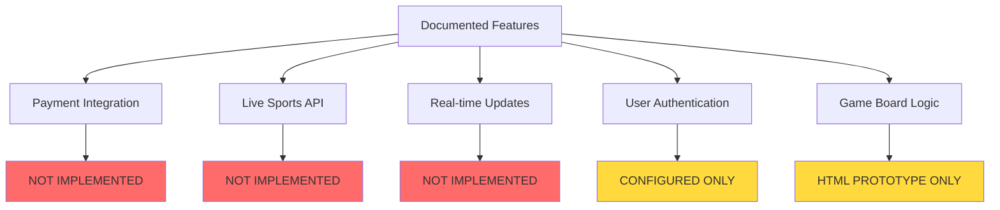
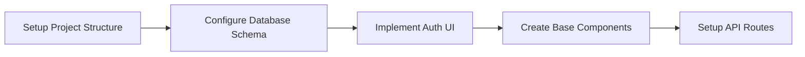
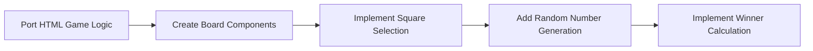
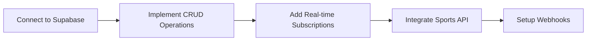
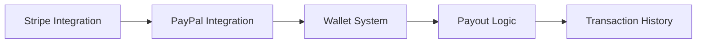
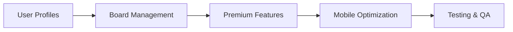

# GridPlay Migration Analysis Report

**Analysis Date:** 2026-02-16  
**Project Version:** 1.0.0  
**Analyst:** Project Analysis Lead

---

## Executive Summary

GridPlay is a digital sports squares betting platform designed to modernize the classic sports betting experience. The project has comprehensive documentation and working HTML prototypes but lacks a complete implementation in the Next.js/React codebase. This analysis identifies the gaps between documentation and implementation, and provides a migration blueprint.

---

## 1. Application Overview

### Purpose
GridPlay automates sports squares games for events like Super Bowl parties, March Madness, and casual game nights. It transforms chaotic paper grids into real-time digital boards with live score tracking and instant payouts.

### Core Value Proposition
- **Zero Hassle**: No cash, paper, or manual math
- **Equal Chance**: Luck-based gameplay requiring no sports knowledge
- **Social Buzz**: Perfect for watch parties and group events
- **Instant Payouts**: Automated winner distribution

---

## 2. Current Technology Stack

### Frontend Framework
| Technology | Version | Status |
|------------|---------|--------|
| Next.js | Latest | Configured |
| React | 17.0.2 | Installed |
| TypeScript | 4.3.5 | Configured |
| Chakra UI | 3.7.0 | Installed |
| Tailwind CSS | 3.0.0 | Configured |
| Framer Motion | 12.4.1 | Installed |

### State Management
| Technology | Version | Status |
|------------|---------|--------|
| Recoil | 0.7.0 | Installed |

### Backend & Database
| Technology | Version | Status |
|------------|---------|--------|
| Supabase | 1.0.0 | Configured |
| Prisma | 6.3.1 | Installed |
| Express | 4.17.1 | Custom server |

### Payment Integration
| Technology | Version | Status |
|------------|---------|--------|
| Stripe | 8.137.0 | Installed |
| PayPal SDK | 1.8.1 | Installed |

### HTTP & Utilities
| Technology | Version | Status |
|------------|---------|--------|
| Axios | 1.7.9 | Installed |

---

## 3. Game Modes Documented

### 3.1 Shotgun Board - 2-Row Quick Play
- **Structure**: Top row = Halftime, Bottom row = Final Score
- **Winning**: Last digit of each team's score added wins (e.g., 23-17 → 3+7=10 → 0 wins)
- **Payout**: 90% of pot per row (Halftime and Final), 10% house cut
- **Example**: $1/square pays $9 to halftime winner, $9 to final winner

### 3.2 Classic 10x10 Grid
- **Structure**: 100 squares with 0-9 digits on rows and columns
- **Matching**: Column = home team, Row = visitors
- **Winning**: Each quarter produces a winner
- **Payouts**: Q1: 16%, Halftime: 24%, Q3: 16%, Final: 32%, House: 12%

### 3.3 5x5 Mini Grid
- **Structure**: 25 squares with double digits per row/column
- **Winning**: Same quarter structure as 10x10
- **Payouts**: Same distribution as 10x10

---

## 4. Documented Features Analysis

### 4.1 Fully Documented Features

| Feature | Description | Implementation Status |
|---------|-------------|----------------------|
| Board Creation | Create boards for sports games | **STUB** - Basic form exists |
| Board Joining | Join existing boards | **STUB** - Basic form exists |
| Square Selection | Claim squares on grid | **PROTOTYPE** - HTML only |
| Random Number Assignment | Auto-assign 0-9 after sellout | **PROTOTYPE** - HTML only |
| Score Tracking | Live score updates | **NOT IMPLEMENTED** |
| Winner Calculation | Determine winners per quarter | **PROTOTYPE** - HTML only |
| Timer/Countdown | Game start countdown | **PROTOTYPE** - HTML only |

### 4.2 Partially Implemented Features

| Feature | Current State | Gap |
|---------|---------------|-----|
| User Authentication | Supabase configured | No UI flows |
| State Management | Recoil installed | Minimal usage |
| API Layer | Axios configured | Only stub endpoint |

### 4.3 Not Implemented Features

| Feature | Priority | Complexity |
|---------|----------|------------|
| Payment Processing | HIGH | High |
| Live Sports API Integration | HIGH | Medium |
| Real-time Score Updates | HIGH | High |
| User Profiles | MEDIUM | Medium |
| Board Rooms/Chat | MEDIUM | High |
| Premium User Features | LOW | Medium |
| Social Integration | LOW | Medium |
| Mobile-First Design | MEDIUM | Medium |

---

## 5. File Structure Analysis

### 5.1 Working Prototypes (examples/)
```
examples/
├── home.html       # Board creation/join UI - WORKING
├── 5x5.html        # 5x5 grid game logic - WORKING
├── 10x10.html      # 10x10 grid game logic - WORKING
└── shotgun.html    # Shotgun board logic - WORKING
```

### 5.2 Next.js Implementation (pages/)
```
pages/
├── _app.tsx        # App wrapper with providers - CONFIGURED
├── index.tsx       # Home page - EMPTY FILE
├── create-board.tsx # Board creation - STUB
├── join-board.tsx  # Board joining - STUB
├── shotgun.tsx     # Shotgun grid component - PARTIAL
└── api/
    └── auth.ts     # Auth endpoint - STUB
```

### 5.3 Source Components (src/)
```
src/
├── App.tsx         # Main app - PLACEHOLDER
├── index.tsx       # Entry point - PLACEHOLDER
├── components/
│   ├── Board.tsx   # Board component - PLACEHOLDER
│   ├── Header.tsx  # Header - PLACEHOLDER
│   └── Footer.tsx  # Footer - PLACEHOLDER
├── pages/
│   ├── Home.tsx    # Home page - PLACEHOLDER
│   ├── About.tsx   # About page - PLACEHOLDER
│   └── Contact.tsx # Contact page - PLACEHOLDER
├── services/
│   └── api.ts      # API service - STUB
└── types/
    └── index.ts    # Type definitions - STUB
```

### 5.4 State Management (state/)
```
state/
└── scoreState.ts   # Recoil atom for scores - MINIMAL
```

### 5.5 Utilities (utils/)
```
utils/
└── supabaseClient.ts # Supabase client - CONFIGURED
```

---

## 6. Gap Analysis: Documentation vs Implementation

### Critical Gaps



### Implementation Priority Matrix

| Feature | Business Impact | Technical Effort | Priority |
|---------|-----------------|------------------|----------|
| Game Board Components | HIGH | MEDIUM | P0 |
| Square Selection/Purchase | HIGH | MEDIUM | P0 |
| Random Number Generation | HIGH | LOW | P0 |
| Winner Calculation | HIGH | LOW | P0 |
| User Authentication | HIGH | MEDIUM | P1 |
| Payment Processing | HIGH | HIGH | P1 |
| Live Score Integration | HIGH | MEDIUM | P1 |
| Real-time Updates | MEDIUM | HIGH | P2 |
| User Profiles | MEDIUM | MEDIUM | P2 |
| Board Rooms/Chat | LOW | HIGH | P3 |

---

## 7. Database Schema Requirements

Based on documentation analysis, the following tables are required:

### Core Tables

```sql
-- Users table
users (
  id: uuid PRIMARY KEY,
  email: string,
  username: string,
  balance: decimal,
  created_at: timestamp
)

-- Boards table
boards (
  id: uuid PRIMARY KEY,
  name: string,
  type: enum[shotgun, 5x5, 10x10],
  sport: string,
  game_id: string,
  square_value: decimal,
  house_cut: decimal,
  status: enum[draft, open, locked, completed],
  created_by: uuid REFERENCES users,
  created_at: timestamp
)

-- Squares table
squares (
  id: uuid PRIMARY KEY,
  board_id: uuid REFERENCES boards,
  position: integer,
  owner_id: uuid REFERENCES users,
  row_digit: integer,
  col_digit: integer,
  purchased_at: timestamp
)

-- Games table
games (
  id: uuid PRIMARY KEY,
  sport: string,
  home_team: string,
  away_team: string,
  start_time: timestamp,
  status: enum[scheduled, live, completed],
  api_game_id: string
)

-- Scores table
scores (
  id: uuid PRIMARY KEY,
  game_id: uuid REFERENCES games,
  quarter: integer,
  home_score: integer,
  away_score: integer,
  updated_at: timestamp
)

-- Transactions table
transactions (
  id: uuid PRIMARY KEY,
  user_id: uuid REFERENCES users,
  board_id: uuid REFERENCES boards,
  type: enum[purchase, payout],
  amount: decimal,
  status: enum[pending, completed, failed],
  created_at: timestamp
)
```

---

## 8. API Integration Requirements

### 8.1 Sports Data APIs (Documented)
- **ESPN API**: Free sports data
- **SportsRadar API**: Premium sports data

### 8.2 Required Endpoints

```
GET  /api/games              # List available games
GET  /api/games/:id          # Get game details
GET  /api/games/:id/scores   # Get live scores

POST /api/boards             # Create new board
GET  /api/boards             # List boards
GET  /api/boards/:id         # Get board details
PUT  /api/boards/:id         # Update board

POST /api/squares/purchase   # Purchase squares
GET  /api/squares/:boardId   # Get board squares

POST /api/payments/stripe    # Stripe payment
POST /api/payments/paypal    # PayPal payment

GET  /api/users/:id          # Get user profile
PUT  /api/users/:id          # Update profile
```

---

## 9. Recommended .deprecated Folder Structure

The following files should be moved to `.deprecated/` during migration:

```
.deprecated/
├── src/
│   ├── App.tsx           # Placeholder implementation
│   ├── index.tsx         # CRA-style entry (not needed for Next.js)
│   └── components/
│       ├── Board.tsx     # Empty placeholder
│       ├── Header.tsx    # Basic placeholder
│       └── Footer.tsx    # Basic placeholder
├── public/
│   └── index.html        # Empty file
└── pages/
    └── index.tsx         # Empty file
```

### Files to Keep and Enhance

```
KEEP:
├── pages/_app.tsx        # Provider setup is correct
├── pages/create-board.tsx # Base structure usable
├── pages/join-board.tsx  # Base structure usable
├── pages/shotgun.tsx     # Has working grid logic
├── utils/supabaseClient.ts # Correct configuration
├── state/scoreState.ts   # Base state structure
└── examples/*.html       # Reference implementations
```

---

## 10. Migration Blueprint

### Phase 1: Foundation (Week 1-2)



**Tasks:**
1. Create `.deprecated/` folder and move placeholder files
2. Set up Supabase database schema
3. Implement authentication flows (login, signup, password reset)
4. Create reusable UI components (Button, Input, Modal, Card)
5. Set up API route structure

### Phase 2: Core Game Logic (Week 3-4)



**Tasks:**
1. Convert HTML prototypes to React components
2. Implement 10x10 grid component
3. Implement 5x5 grid component
4. Implement Shotgun board component
5. Add square selection with user attribution
6. Implement Fisher-Yates shuffle for number assignment
7. Create winner calculation logic

### Phase 3: Backend Integration (Week 5-6)



**Tasks:**
1. Connect board operations to Supabase
2. Implement real-time square updates
3. Integrate ESPN/SportsRadar API
4. Set up score update webhooks
5. Implement game status tracking

### Phase 4: Payments (Week 7-8)



**Tasks:**
1. Implement Stripe checkout
2. Implement PayPal checkout
3. Create user wallet system
4. Implement automatic payouts
5. Add transaction history

### Phase 5: Polish & Features (Week 9-10)



**Tasks:**
1. Implement user profile pages
2. Add board management dashboard
3. Implement premium user features
4. Optimize for mobile devices
5. Write comprehensive tests

---

## 11. Technical Debt & Issues

### Current Issues

1. **Empty Files**: `pages/index.tsx` is completely empty
2. **Missing CSS**: Components reference non-existent CSS files (`App.css`, `Board.css`)
3. **Outdated Dependencies**: React 17 instead of 18, old Supabase client
4. **Mixed Architecture**: Both `src/` and `pages/` have React components
5. **No Error Handling**: API calls lack proper error handling
6. **No Tests**: Zero test coverage

### Recommended Fixes

1. Consolidate component structure under `components/`
2. Update to React 18 and latest Supabase client
3. Remove unused dependencies
4. Add comprehensive error boundaries
5. Implement proper logging
6. Add unit and integration tests

---

## 12. Security Considerations

### Documented Requirements
- End-to-end encryption
- GDPR compliance
- PCI-compliant payment gateways

### Implementation Needs
- Input validation on all forms
- Rate limiting on API routes
- CSRF protection
- Secure session management
- Encrypted sensitive data storage

---

## 13. Conclusion

GridPlay has a solid conceptual foundation with working HTML prototypes demonstrating core game mechanics. The Next.js implementation is in early stages with mostly stub files. The migration requires:

1. **Immediate**: Move placeholder files to `.deprecated/`
2. **Short-term**: Port HTML game logic to React components
3. **Medium-term**: Implement backend integration and payments
4. **Long-term**: Add premium features and optimize

The existing HTML prototypes in `examples/` provide clear reference implementations for the game logic, making the migration straightforward from a logic perspective. The primary challenges lie in:

- Payment integration complexity
- Real-time score synchronization
- Sports API integration
- Mobile-first responsive design

---

## Appendix A: File Inventory

| File Path | Lines | Status | Action |
|-----------|-------|--------|--------|
| `README.md` | 122 | Complete | Keep |
| `package.json` | 39 | Complete | Update deps |
| `examples/home.html` | 202 | Working | Reference |
| `examples/5x5.html` | 464 | Working | Reference |
| `examples/10x10.html` | 355 | Working | Reference |
| `examples/shotgun.html` | 326 | Working | Reference |
| `pages/index.tsx` | 0 | Empty | Deprecate |
| `pages/create-board.tsx` | 32 | Stub | Enhance |
| `pages/join-board.tsx` | 32 | Stub | Enhance |
| `pages/shotgun.tsx` | 107 | Partial | Enhance |
| `src/App.tsx` | 13 | Placeholder | Deprecate |
| `src/index.tsx` | 11 | Placeholder | Deprecate |
| `src/components/*` | ~11 each | Placeholder | Deprecate |
| `utils/supabaseClient.ts` | 6 | Configured | Keep |

---

## Appendix B: Dependency Updates Recommended

```json
{
  "dependencies": {
    "react": "^18.2.0",
    "react-dom": "^18.2.0",
    "@supabase/supabase-js": "^2.39.0",
    "stripe": "^14.0.0",
    "typescript": "^5.3.0"
  }
}
```

---

**Report Generated:** 2026-02-16  
**Next Steps:** Review with implementation team and begin Phase 1 migration
